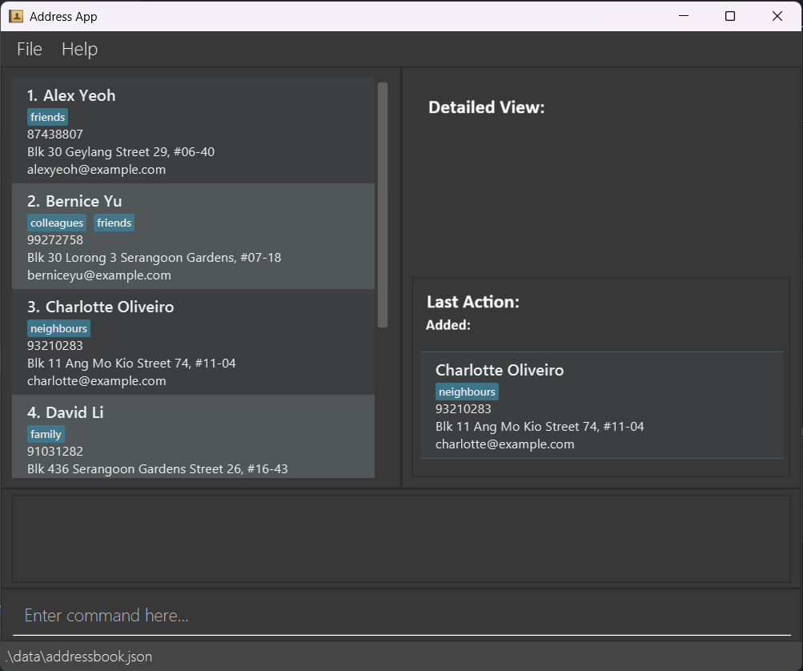

# AddressMe

## About
***
AddressMe is an app that...

## User Interface

## Features
***

## Usage
***
- Organize your destinations
- Plan your trips
- Schedule your day
- Easily compile booking contacts and addresses

For the detailed documentation of this project, see the **[AddressMe Website](https://AY2526S2-CS2103T-W14-3.github.io/tp/)**.

## Acknowledgements
***
This project is based on the AddressBook-Level3 project created by the [SE-EDU initiative](https://se-education.org).
