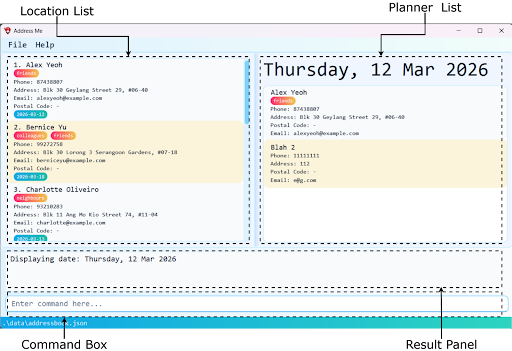
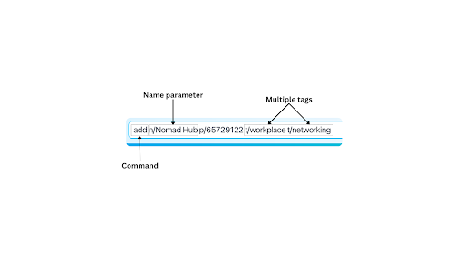

---

> **FAST • FLEXIBLE • FOOLPROOF**

_Purpose-built, clutter-free itinerary planner designed for digital nomads_

---

AddressMe helps you **plan and track** your travel destinations, dates, and important details in one convenient platform, optimised for use entirely through a **Command Line Interface** (CLI) with the benefits of a Graphical User Interface (GUI).

It offers a **minimalist, easy-to-learn experience** designed for digital nomads who need their location data to be structured and always accessible. If you can type quickly and get frustrated by over-engineered itinerary planners, AddressMe is the app for you!

---

## Do you

- **Move regularly** and need to track multiple locations and visit plans?
- Need your data even with **unreliable internet**?
- Prefer **typing** over clicking through menus?
- Feel frustrated by overly complicated itinerary planners?

### **If so, AddressMe is built for you!**


* Table of Contents
{:toc}

--------------------------------------------------------------------------------------------------------------------
## 1. Quick Start

---
### Installation

1. Ensure you have Java `17` or above installed on your machine.<br>
   You can do this by opening the Command Prompt app (for Windows users), or Terminal (for Mac/Linux users) and entering "`java -version`".<br>
1. Download the latest version of `AddressMe.jar` from the GitHub releases page [here](https://github.com/AY2526S2-CS2103T-W14-3/tp/releases). 
2. Place the AddressMe.jar file in a folder - this becomes your AddressMe home folder. 
3. While in your home folder, right-click and select "Open in Terminal"
   
4. Enter the following command into the terminal:
   `java -jar addressbook.jar`
5. That's it! AddressMe launches with sample data, and you can plan your trip immediately.

<div markdown="block" class="alert alert-warning">

**:warning: Mac users:**<br>

Ensure you have the exact Java JDK version [here](https://se-education.org/guides/tutorials/javaInstallationMac.html) to avoid compatibility issues.

</div>

### Interface Overview

AddressMe has four main UI zones:

| **Feature**       | **Description**                                                          |
| ----------------- | ------------------------------------------------------------------------ |
| **Command Box**   | Type your commands here and press Enter to execute.                      |
| **Result Panel**  | Displays confirmation messages, search results, and errors encountered.  |
| **Location List** | Shows all your saved locations, updated in real time after each command. |
| **Planner Panel** | View destinations on a specific date (using the **plan** command).       |

## 2. Starting to use Commands

Before we dive into each feature, here's a tip to make everything smooth and easy.

Every command has a helpful guiding message:


A valid **add** command is shown below.



| **Format**               | **Description**                                                                                                                                                       |
| ------------------------ | --------------------------------------------------------------------------------------------------------------------------------------------------------------------- |
| **UPPER_CASE**           | A value you must supply. e.g. NAME in add n/NAME means you type the actual name.<br><br>e.g. "_n/_**_Nomad Hub_**_"_                                                  |
| **\[Square brackets\]**  | Optional parameters. You may include it or leave it out.<br><br>E.g. _"_**_\[e/EMAIL\]_**_"_ is optional so we can leave it out.                                      |
| **t/TAG...**             | The ellipsis means you can submit more than one of these parameters.<br><br>e.g. "_t/_**_workplace_**_" OR "t/_**_workplace_** _t/_**_networking_**_"_                |
| **Any order**            | Parameters can be entered in any order unless specified otherwise.<br><br>e.g. "_t/_**_workplace_** _n/_**_Nomad Hub_**_" OR "n/_**_Nomad Hub_** _t/_**_workplace_**" |
| **Single-word commands** | Some commands take no extra parameters, like **help**, **list**, **exit**, **clear**.                                                                                 |

### Date Formats

AddressMe even accepts a large range of date inputs so you can type dates flexibly.

- Dates are separated with **slashes** ("**/**") or **hyphens** ("**\-**").
- With **day**, **month** and **year** fully specified:

| **With slashes** | **With hyphens** |
|------------------|------------------|
| **YYYY/MM/DD**   | **YYYY-MM-DD**   |
| **YYYY/MM/DD**   | **YYYY-MM-DD**   |
| **YYYY/M/D**     | **YYYY-M-D**     |
| **D/M/YYYY**     | **D-M-YYYY**     |
| **D/M/YY**       | **D-M-YY**       |

- With **day** and **month** (no **year**): AddressMe picks the next occurrence of that date.

| **DD/MM** | **DD-MM** |
| --------- | --------- |
| **D/M**   | **D-M**   |

- With **day of the week** (case-insensitive): AddressMe picks the upcoming date of that weekday.

| **Monday - Sunday** | **Mon - Sun** |
| ------------------- | ------------- |


<div markdown="span" class="alert alert-primary">

**:bulb:Pro Tip - Fast Dates:**
If today is Tuesday, typing `Tue` matches today. Typing `Wednesday` or `Wed` matches tomorrow. Typing `Mon` matches next Monday!<br>
Alternatively, typing `today` also works!

</div>

---
### Start Your First Commands

Now that you're familiar with commands, try typing these commands into AddressMe to get a feel for the application.

- **`list`**

Shows all saved locations.

- **`find Cafe`**

Searches for any location with 'Cafe' in its name.

- **`add n/Nomad Hub e/hello@nomadhub.com a/12 Tanjong Pagar t/coworking`**

Adds a new coworking space.

- **`plan 2026-04-01`**

Shows your itinerary plan for 1 April 2026.

- **`exit`**

Closes the application.

When you're comfortable with sending commands, you're ready to dive deeper into each [feature](#features)!

--------------------------------------------------------------------------------------------------------------------

## 3. Features - Full Reference

### Viewing help : `help`

Shows you commands you can use, as well as _how_ to use specific commands.

Formats:
```
help
help COMMAND_WORD
help -ug
```

* `help` displays a summary of all supported commands in AddressMe.
* `help COMMAND_WORD` displays detailed local guidance for that command.<br>
`COMMAND_WORD` must be an existing built-in command word.

> Example:
> `help add` shows the specific usage for the `add` command.

* `help -ug` opens the help window for the link to the online User Guide (see below).


<div markdown="span" class="alert alert-primary">:bulb: **Tip:**
If you minimise the Help window and run help again, the minimised window will not reappear automatically. Restore it manually from your taskbar.
</div>

### Adding a location: `add`

Saves a new location to your address book, with optional visit dates and tags for easy retrieval later.

Format: `add n/NAME [p/PHONE_NUMBER] [e/EMAIL] [a/ADDRESS] [c/POSTAL_CODE] [d/DATE]... [t/TAG]...`


<div markdown="block" class="alert alert-info">

**:information_source: Field Guide:**<br>
**n/**: Name of the location (e.g. the cafe, clinic, or coworking space).

**p/**: Phone number - accepts numbers only, and must be 15 digits or less.

**e/**: Email address.

**a/**: Street address.

**c/**: Postal code - must be alphanumeric.

**d/**: Visit date - accepts any format from Section 3. Repeat for multiple dates.

**t/**: Tag for categorisation (e.g. halal, coworking, pharmacy). Repeat for multiple tags.
</div>

> Examples:<br>
> `add n/Nomad Hub p/98765432 e/hello@nomadhub.com a/12 Tanjong Pagar d/2026-04-01 t/coworking`<br>
> 
> `add n/Al-Azhar Restaurant p/63910060 e/contact@alazhar.sg a/18 Arab St t/halal t/dinner d/Friday`

<div markdown="span" class="alert alert-primary">:bulb: **Tip:**
A location can have any number of tags and visit dates - including none at all. You can always add them later using the edit command.
</div>

### Listing all locations : `list`

Shows a list of all locations in the address book.

Format: `list`

### Managing command shortcuts : `shortcut`

Creates, removes, and lists shortcuts for existing command words.

Format:
```
shortcut set ALIAS COMMAND_WORD
shortcut remove ALIAS
shortcut list
```

* Only the first token of user input is expanded.
* Aliases are case-insensitive and are stored in lowercase.
* Aliases must start with a letter and contain only alphanumeric characters.
* Aliases cannot reuse existing command words such as `add` or `list`.
* `COMMAND_WORD` must be an existing built-in command word.

Examples:
* `shortcut set a add`     Creates alias 'a' for 'add'
* `shortcut set e edit`    Creates alias 'e' for 'edit'
* `shortcut list`          Lists all defined shortcuts
* `shortcut remove e`      Removes alias 'e'

### Editing a location : `edit`

Edits an existing location in the address book.

Format: `edit INDEX [n/NAME] [p/PHONE] [e/EMAIL] [a/ADDRESS] [d/DATE]… [d+/DATE]… [d-/DATE]… [t/TAG]… [t+/TAG]… [t-/TAG]…`

* Edits the location at the specified `INDEX`. The index refers to the index number shown in the displayed location list. The index **must be a positive integer** 1, 2, 3, …​
* At least one of the optional fields must be provided.
* Existing values will be updated to the input values.
* When editing tags or visit dates using `t/` or `d/`, the existing tags/dates of the location will be removed i.e. adding is not cumulative.
* You can add or remove individual tags or visit dates without affecting others using `t+/`, `t-/`, `d+/`, or `d-/`.
* You cannot mix `t/` with `t+/` or `t-/` for the same command. Similarly, `d/` cannot be mixed with `d+/` or `d-/`.
* You can remove all the location’s tags or visit dates by typing `t/` or `d/` without specifying any values after it.

Examples:
*  `edit 1 p/91234567 e/johndoe@example.com` Edits the phone number and email address of the 1st location to be `91234567` and `johndoe@example.com` respectively.
*  `edit 2 n/Betsy Crower t/ d+/2026-01-01` Edits the name of the 2nd location to be `Betsy Crower`, clears all existing tags, and adds a visit date of `2026-01-01`.
*  `edit 1 d-/2025-12-25` Removes the visit date `2025-12-25` from the 1st location.

### Locating locations by name or other attributes: `find`

Finds locations whose attributes match all of the given parameters (AND semantics across all specified prefixes and repeated prefixes). Unprefixed keywords before any prefix are treated as name keywords combined with OR semantics.

Format: `find [KEYWORD] [MORE_KEYWORDS] [n/NAME] [p/PHONE] [e/EMAIL] [a/ADDRESS] [t/TAG] [d/DATE]`

* The search is case-insensitive. e.g `thai` will match `Thai Pavilion`
* The order of the unprefixed name keywords (the preamble) does not matter. e.g. `Restaurant Marina` will match `Marina Restaurant`.
* **Substring matching is supported** for Name, Phone, Email, and Address. Tag matching is exact but case-insensitive.
* Multiple prefixes (and multiple occurrences of the same prefix) can be used to narrow down the search using AND semantics. e.g., `n/Bakery t/Halal t/Vegetarian` will find locations that have "Bakery" in their name AND have both the "Halal" and "Vegetarian" tags.
* Only the unprefixed name keywords use OR semantics: a location matches if its name contains at least one of those keywords. e.g., `find Ramen Cafe` will return `Ramen House`, `Cafe Mocha`.
* Each prefixed value (`n/`, `p/`, `e/`, `a/`, `t/`, `d/`) is treated as a single search string, even if it contains spaces (no further splitting into keywords is done).
* **Date search** (`d/`) accepts any date format or keyword supported by AddressMe’s date parser (including formats like `YYYY-MM-DD` and `DD/MM/YYYY`, e.g. `15/01/2024`).
* Since a location can have multiple visit dates, a location matches the search if **any** of its visit dates match the given date.
* Using multiple `d/` prefixes will find locations that have **all** of the specified visit dates (AND logic).

Examples:
* `find Restaurant` returns all locations with "Restaurant" in the name.
* `find n/Hanjin p/9123` returns locations with "Hanjin" in the name AND "9123" in the phone number.
* `find t/Japanese t/Halal` returns locations that have BOTH "Japanese" AND "Halal" tags.
* `find d/2023-10-15` returns locations visited on 15th Oct 2023.
* `find d/2023-10-15 d/2023-11-20` returns locations visited on BOTH 15th Oct 2023 AND 20th Nov 2023.
* `find Marina Beach` returns `Marina Park`, `Beach Resort` (OR search for names).
* `find n/Cafe e/gmail.com` returns all cafes with a Gmail address.

### Deleting a location : `delete`

Deletes one or more specified locations from the address book.

Format: `delete INDEX [MORE_INDEXES]...`

* Deletes the locations at the specified `INDEX` values.
* The indices refer to the index numbers shown in the displayed location list.
* Every index **must be a positive integer** 1, 2, 3, …​
* Duplicate indices are not allowed.

Examples:
* `list` followed by `delete 2` deletes the 2nd location in the address book.
* `find Sentosa` followed by `delete 1` deletes the 1st location in the results of the `find` command.
* `list` followed by `delete 1 3 5` deletes the 1st, 3rd, and 5th locations in the address book.

### Recording a note : `note`

Records a date-bound note that will be persisted in future milestones. Currently it validates syntax via CLI and confirms receipt.

Format: `note n/NOTE d/DATE` (DATE required)

Examples:
* `note n/Great place d/2026-03-24`

### Deleting a note: `note d-`

Deletes a note by date.

Format: note d-/DATE

Example:
* `note d-/2026-03-24`

### Using the itinerary planner : `plan`

Displays the list of locations assigned to a date.

Format: `plan [DATE]`

* Displays all the locations with the specific date in the GUI for easy cross-referencing
* If used without a date input, clears the planner instead.

Examples:
* `plan 12/3/26` shows the locations planned for 12 March 2026 on the planner.
* `plan` clears the planner page.

### Changing the application theme : `theme`

Switches the application between light mode and dark mode.

Format:
```
theme light
theme dark
```

* Use `theme light` to switch to light mode.
* Use `theme dark` to switch to dark mode.
* The selected theme is saved and restored the next time the app starts.

### Clearing all entries : `clear`

Clears all entries from the address book.

Format: `clear`

### Exiting the program : `exit`

Exits the program.

Format: `exit`

### Saving the data

AddressBook data are saved in the hard disk automatically after any command that changes the data. There is no need to save manually.

### Editing the data file

AddressBook data are saved automatically as a JSON file `[JAR file location]/data/addressbook.json`. Advanced users are welcome to update data directly by editing that data file.

<div markdown="span" class="alert alert-warning">:exclamation: **Caution:**
If your changes to the data file makes its format invalid, AddressBook will discard all data and start with an empty data file at the next run. Hence, it is recommended to take a backup of the file before editing it.<br>
Furthermore, certain edits can cause the AddressBook to behave in unexpected ways (e.g., if a value entered is outside of the acceptable range). Therefore, edit the data file only if you are confident that you can update it correctly.
</div>

### Archiving data files `[coming in v2.0]`

_Details coming soon ..._

## CLI Features

### Accessing input history
During the session, your inputs are recorded.

While clicked into the CLI, press the `UP arrow` and `DOWN arrow` to navigate through previously entered commands.

E.g. After entering `list` and `find John` into the CLI, pressing `UP` while in the empty text field will write `find John` in the textbox. Pressing `UP` again will replace it with `list`.

### Autocomplete
While having text in the command line, the user can press the `Tab` key to attempt to autocomplete the command.

The autocomplete uses the current text to find matching command keywords, while being case-insensitive. If there are multiple matches, it fills to the longest shared prefix.

E.g. `A` autocompletes into `add`, while `e` autocompletes to `e`, since both `exit` and `edit` are possible commands.

--------------------------------------------------------------------------------------------------------------------

## FAQ

**Q**: How do I transfer my data to another Computer?<br>
**A**: Install the app in the other computer and overwrite the empty data file it creates with the file that contains the data of your previous AddressBook home folder.

--------------------------------------------------------------------------------------------------------------------

## Known issues

1. **When using multiple screens**, if you move the application to a secondary screen, and later switch to using only the primary screen, the GUI will open off-screen. The remedy is to delete the `preferences.json` file created by the application before running the application again.
2. **If you minimize the Help Window** and then run the `help` command (or use the `Help` menu, or the keyboard shortcut `F1`) again, the original Help Window will remain minimized, and no new Help Window will appear. The remedy is to manually restore the minimized Help Window.

--------------------------------------------------------------------------------------------------------------------

## Command summary

Action | Format, Examples
--------|------------------
**Add** | `add n/NAME p/PHONE_NUMBER e/EMAIL a/ADDRESS [d/DATE]… [t/TAG]…​` <br> e.g., `add n/James Ho p/22224444 e/jamesho@example.com a/123, Clementi Rd, 1234665 d/2026-01-01 t/friend t/colleague`
**Note** | `note n/NOTE d/DATE` <br> e.g., `note n/Great place d/2026-03-24`
**DeleteNote** | `note d-/DATE` <br> e.g., `note d-/2026-03-24`
**Clear** | `clear`
**Delete** | `delete INDEX [MORE_INDEXES]...`<br> e.g., `delete 3` or `delete 1 2 3`
**Edit** | `edit INDEX [n/NAME] [p/PHONE_NUMBER] [e/EMAIL] [a/ADDRESS] [d/DATE]… [d+/DATE]… [d-/DATE]… [t/TAG]… [t+/TAG]… [t-/TAG]…`<br> e.g.,`edit 2 n/James Lee e/jameslee@example.com d+/2026-02-01`
**Find** | `find [KEYWORD] [MORE_KEYWORDS] [n/NAME] [p/PHONE] [e/EMAIL] [a/ADDRESS] [t/TAG]… [d/DATE]…`<br> e.g., `find n/Cafe t/Halal d/2026-01-01`
**List** | `list`
**Help** | `help` / `help COMMAND_WORD` / `help -ug`<br> e.g., `help`, `help add`, `help -ug`
**Shortcut** | `shortcut set ALIAS COMMAND_WORD` / `shortcut remove ALIAS` / `shortcut list`<br> e.g., `shortcut set a add`, `shortcut remove a`, `shortcut list`
